# My Work Companion Domain Relationships

Mermaid diagrams showing aggregate relationships, processing flows, and composition views.

---

## 1. Aggregate Relationship Map

Shows which aggregates reference which via ID. All aggregates are scoped to a User (UserId omitted from arrows for clarity). Solid arrows indicate required references; dashed arrows indicate optional references.

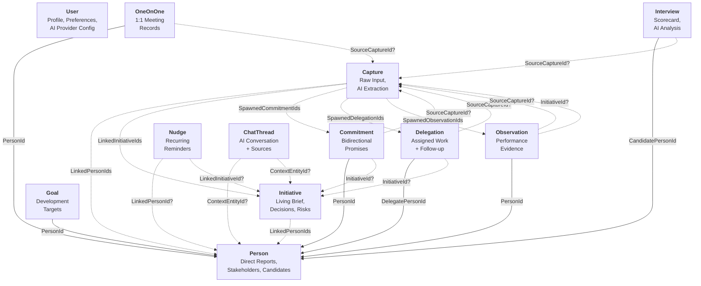

### Aggregate Boundary Rules

| Rule | Description |
|------|-------------|
| **No embedded aggregates** | Aggregates reference each other only by ID, never by direct containment |
| **Value objects are embedded** | KeyDecision, Risk, ActionItem, Scorecard etc. live inside their parent aggregate |
| **User scoping** | Every aggregate carries a `UserId` -- this is the tenancy boundary |
| **Capture is the bridge** | Capture links raw input to all other aggregates via spawned/linked IDs |
| **Person is the hub** | Most aggregates reference Person -- it is the central relationship entity |

---

## 2. Capture Processing Flow

Shows the journey from raw input through AI extraction to linked domain entities.

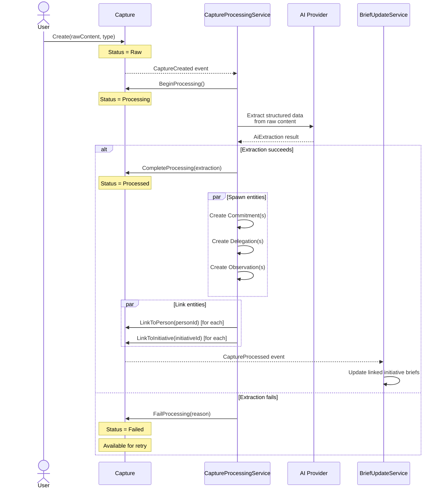

### Extraction Data Flow

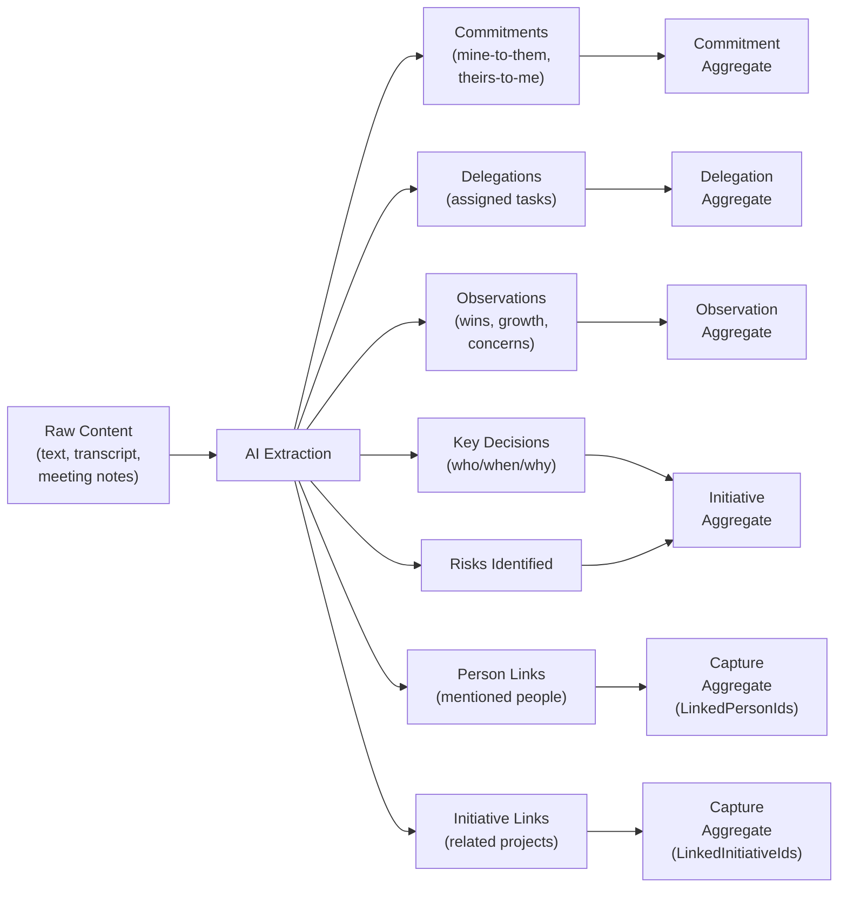

---

## 3. Initiative Brief Update Flow

Shows how the living brief stays current as new data arrives from multiple sources.

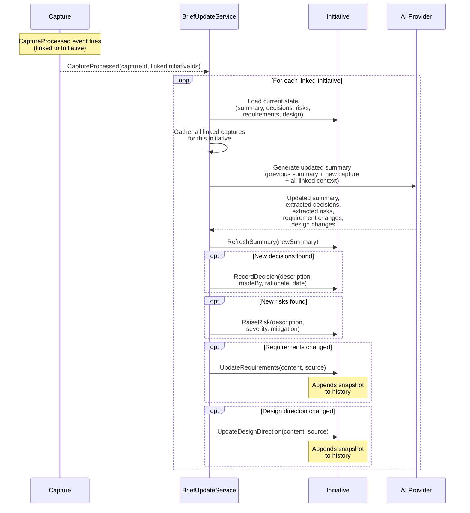

### Brief Composition

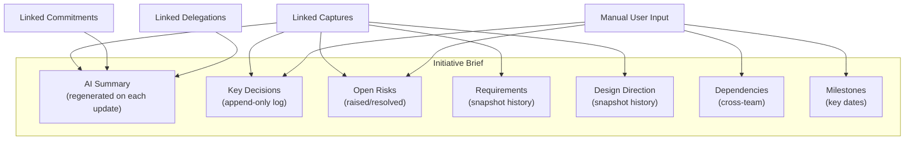

---

## 4. My Queue Composition

Shows what feeds into the prioritized queue view and how items are ranked.

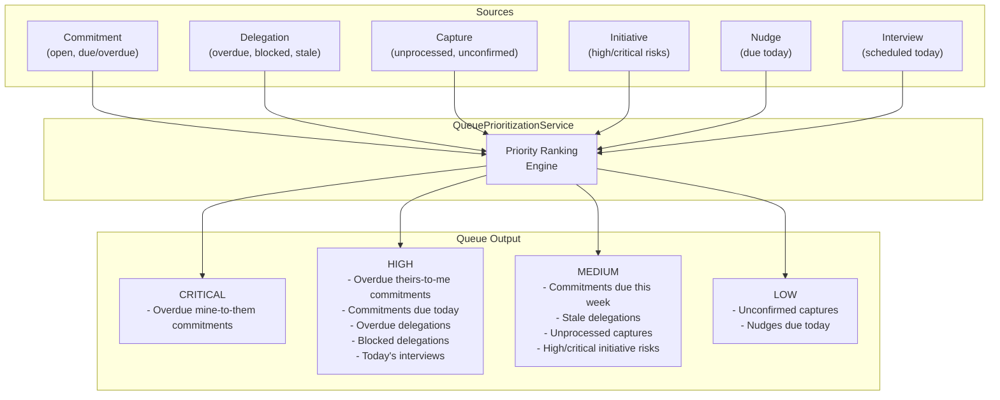

### Queue Filtering

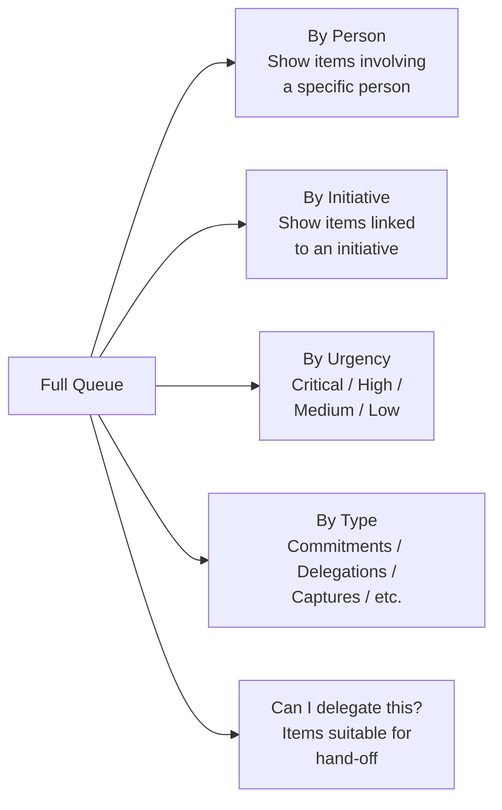

---

## 5. Briefing Generation Flow

Shows how the daily and weekly briefings are assembled from multiple data sources.

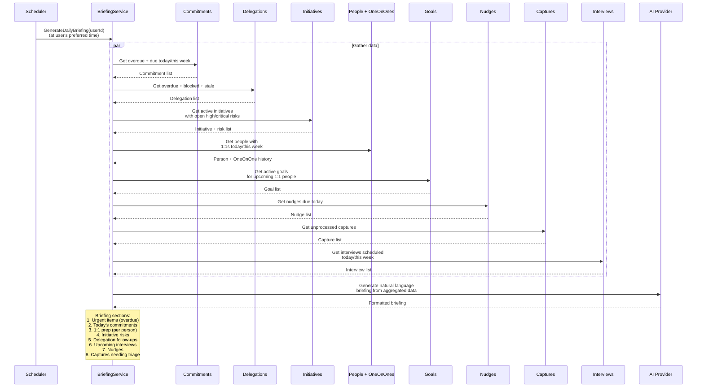

### Weekly Briefing Additional Sections

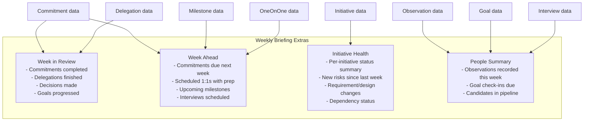

### 1:1 Prep Sheet Composition

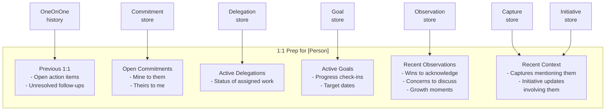

---

## 6. Entity Lifecycle Overview

Shows how the main entities flow through the system over time.

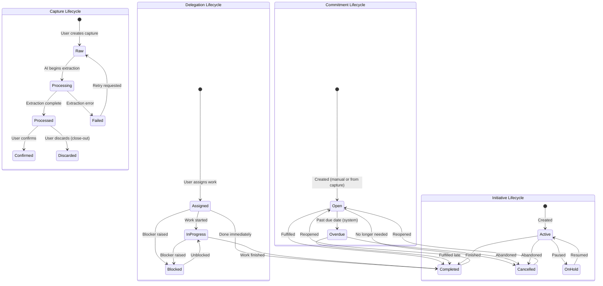
